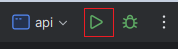
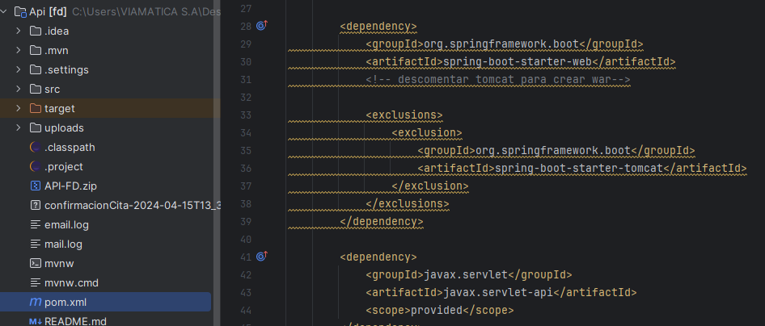

<p align="center"><a href="#" target="_blank"></a></p>

 
# Backend

## Configuraciones de manera local
---
### Levantar el proyecto
- Importante detener el servicio wildfly

- Una vez clonado el proyecto de manera local, procedemos abrirlo en IntelliJ IDEA y presionar el siguiente boton.



### Limpiar archivos
- Primero debe detener el proyecto.
- Antes de crear el proyecto en .war se debe limpiar los directorios.
- Dentro de la terminal del IDE, escribir los siguientes comandos 
```
   rm -r target
   rm -classpath
   rm -proyect
   mvn eclipse:eclipse
   mvn clean package
```


### Crear Archivo.War
 - Dirigise al directorio target y luego al archivo pom.xml
 - Debe tener descomentado el tomcat que se muestra en la siguiente imagen:

 -Luego debe comentar el tomcat y jasper que se muestra en la siguiente imagen:

- Una vez hecho los pasos anterior, ejecutar el proyecto.


---
## Deployment 
---
- Importante tener conectado la VPN
- Iniciar el servicio de wildfly
- Abrir el navegador y coloque la siguiente url: http://127.0.0.1:9990, luego deberá ingresar las credenciales previamente definidas y dar en “Iniciar sesión”.
- Ubicarse en la pestaña "DESPLOYMENTS", en el sidenav presione el boton "+" y luego dar click en "Upload Deployment" en donde se va aperturar una ventana.
- Dirigirse la ruta del directorio en donde se encuentra el archivo.war y arrastrarlo dentro de la ventana.
- Dar click en Next, asegurar de que en Enable esté en "ON" y por ultimo finalizamos.

### En caso de error 
- 

