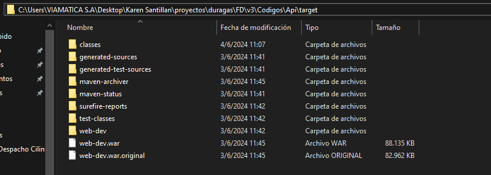

 <p align="center"><a href="#" target="_blank"></a></p>

# Backend

##  Requisitos
  - Herramientas necesarias:
    * Java 8 - JDK
    * Maven 3.8.6
    * Apache CouchBD versión 3.3.3
    * WildFly versión 18.0.1 - (Importante configurar WildFly como servicio de Windows)

  - Descargar IDE de preferencia para Java:
    * IntelliJ IDEA Community Edition (recomendado) 
    * Apache Netbeans 11
  
  - Descargue la carpeta FA que se encuentra dentro del repositorio principal en la carpeta de resource y descomprímala en el disco local C.
  
  <!-- - Verificar en la API del proyecto, se encuentre el archivo "com.microsoft.sqlserver-0.4.1.jar" que está ubicado en la carpeta de recursos, para la instalacion del mismo abra la terminal del IDE d   -->

  <!-- - Una vez descargado la carpeta FA, siga las siguientes instrucciones:
    * Descargar el archivo "com.microsoft.sqlserver-0.4.1.jar" y ubicarlo en la Api principal dentro de la carpeta de resource.
    * Pot ultimo abrir la terminal del IDE Y ejecutar el siguiente comando:
    ```
    mvn install:install-file -Dfile=com.microsoft.sqlserver-0.4.1.jar -DgroupId=sqljdbc41 -DartifactId=com.microsoft.sqlserver -Dversion=0.4.1 -Dpackaging=jar -DgeneratePom=true
    ``` -->

## Contenido

- [1.- Configuraciones de manera local](#1--configuraciones-de-manera-local)
- [2.- Servidor](#2--servidordeployment)

## 1.- Configuraciones de manera local

---

### 1.1.- Levantar el proyecto

- Revisar si el servicio wildfly está detenido, si está en ejecución proceda a detenerlo.
- Una vez clonado el proyecto de manera local, procedemos abrirlo en el IDE
- Ubicarse en el archivo pom.xml, busque las siguientes dependencia en el cual debe seguir las siguientes instrucciones:

  - Debe tener comentado el tomcat, como se presenta en la siguiente imagen:

  

  - Debe tener descomentado el tomcat y jasper, como se presenta en la siguiente imagen:

  

- Una vez hecho las modificaciones, proceda actualizar el maven.

  

- Finalmente ejecutar el proyecto.

### 1.2.- En caso de error al levantar el proyecto

- Abrir la terminal del IDE, escribir los siguientes comandos

```
   rm -r target
   rm .classpath
   rm .proyect
   mvn eclipse:eclipse

```

- En caso de que no se compile el proyecto, comuniquese con el lider tecnico.

```

```

### 1.3 Proceso de creación y ubicación del archivo .war

### 1.3.1- Guia para crear Archivo .war

- Detener la API del proyecto principal antes de proceder con la creación del archivo .war en el siguiente paso.

- AVISO: Dirigirse al archivo pom.xml, Para la generación del archivo .jar puede variar según el ambiente:

  * Para el ambiente de servidor de calidad y local, se especifica con el nombre de "Web-dev".

  * Para el ambiente en fase de producción, se especifica con el nombre de "Web".


- Una vez hecho el paso anterior segun el ambiente, busque las siguientes dependencia en el cual debe seguir las siguientes instrucciones:

  - Debe tener descomentado el tomcat, como se presenta en la siguiente imagen:

    

  - Luego debe comentar el tomcat y jasper, como se presenta en la siguiente imagen:

    

- Una vez hecho las modificaciones, proceda actualizar el maven.

  

- Por ultimo abrir la terminal del IDE, escribir los siguientes comandos

```
   rm -r target
   rm .classpath
   rm .proyect
   mvn eclipse:eclipse
   mvm clean package
```

### 1.3.2 Ubicación del archivo .war

- Una vez hecho el paso anterior, el archivo .war se generará dentro del Api principal en el directorio de target, para más detalles, vea el ejemplo en la siguiente imagen:

  

- Después de localizar el archivo .war, continúe con el siguiente proceso.

---

### 1.4.- Despliegue de archivo .war en WildFly de manera local

---

- Importante detener la api del proyecto principal
- Debe estar en ejecución el servicio Wildfly
- Seguir las instrucciones del manual en el punto 1.3 que se encuentra en el siguiente URL:

```
https://drive.google.com/file/d/104GB6vxkwW3gItneXXyoz6LIShzNCoVW/view?usp=sharing
```

- Si existe problema al desplegar, dirigirse nuevamente al directorio bin, ubicarse en el archivo "standalone.conf.bat" dar clic en editar, luego busque el parámetro "-XX:MaxMetaspaceSize" y modificarlo al tamaño de "3052m" y guarde los cambios.

- Por ultimo reiniciar el servicio de wildlfy y repita las instrucciones del manual en el punto 1.5 de la seccion de "despliegue del wildfly".

### 1.4.1.- En caso de error al deployar

- En caso de seguir con el error, comuniquese con el lider tecnico.

```

```

---

## 2.- Servidor(Deployment)

---

- Importante tener conectado la VPN
- Debe estar en ejecución el servicio Wildfly
- Seguir las instrucciones del manual en el siguiente URL:

```
https://drive.google.com/file/d/1UtDTKeJoT0L83zkxVDLSNSeeKgRmvZEF/view?usp=sharing
```
