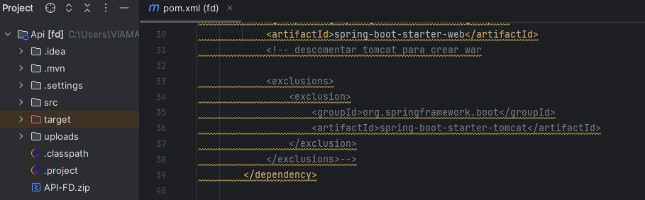
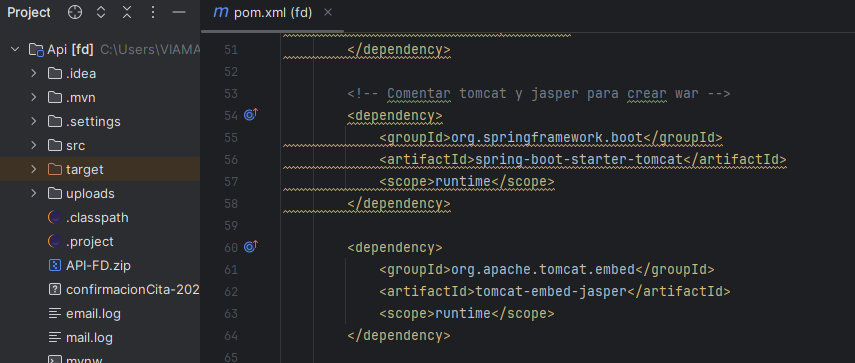
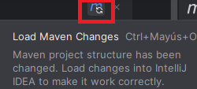
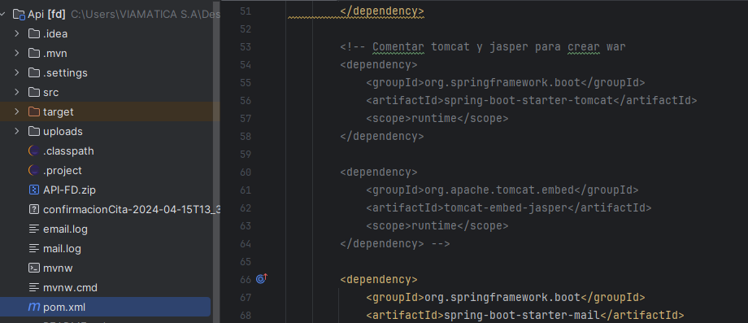
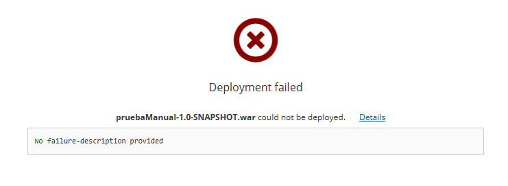
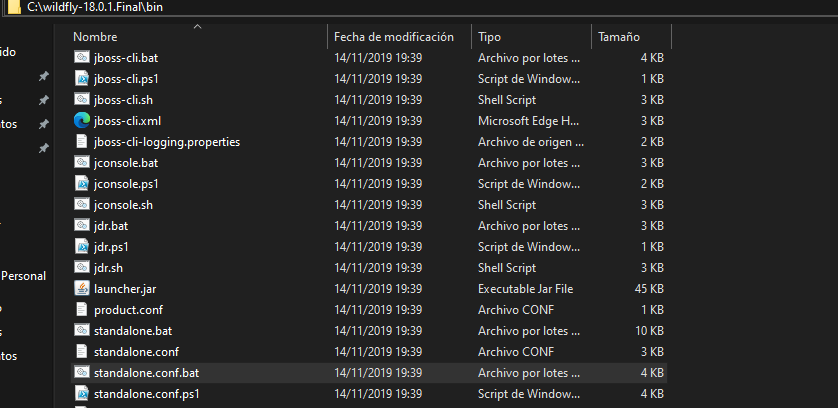
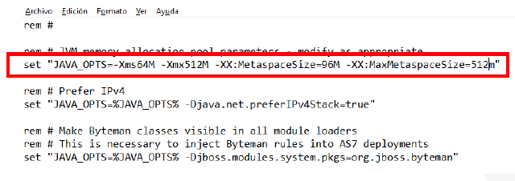

<p align="center"><a href="#" target="_blank"></a></p>

 
# Backend
## Contenido
- [1.- Configuraciones de manera local](#1--configuraciones-de-manera-local)
- [2.- Servidor](#servidor-deployment)


## 1.- Configuraciones de manera local
---
### 1.1.- Levantar el proyecto
- Revisar si el servicio wildfly esté detenido, si esta en ejecución proceda a detenerlo.
- Una vez clonado el proyecto de manera local, procedemos abrirlo en el IDE 
- En el archivo pom.xml, busque las siguientes dependencia en el cual debe seguir las siguientes intrucciones:
   
   * Debe tener comentado el tomcat como se presenta la siguiente imagen:

   

   * Debe tener descomentado el tomcat y jasper como se presenta las siguiente imagen:

   


- Una vez hecho las modificaciones, proceda actualizar el maven.

   

- Finalmente ejecutar el proyecto.


### 1.2.- En caso de error al levantar el proyecto

- Abrir la terminal del IDE, escribir los siguientes comandos
```
   rm -r target
   rm .classpath
   rm -proyect
   mvn eclipse:eclipse
   
```
- En caso de que no se compile el proyecto, Comunicar a la persona encargada: 
```
```

### 1.3.- Guia para crear Archivo.War
 - Dirigise al archivo pom.xml
 - Debe tener descomentado el tomcat que se muestra en la siguiente imagen:

- Luego debe comentar el tomcat y jasper que se muestra en la siguiente imagen:

- Una vez hecho los pasos anterior, Abrir la terminal del IDE, escribir los siguientes comandos
```
   rm -r target
   rm .classpath
   rm -proyect
   mvn eclipse:eclipse
   mvm clean package
```
- Por ultimo Ejecutar el proyecto.


---
### 1.4.- Levantar servidor de manera local
---
 - Revisar el servicio wildfly esté detenetido, 
- Abrir el navegador y coloque la siguiente url: http://127.0.0.1:9990, luego deberá ingresar las credenciales previamente definidas y dar en “Iniciar sesión”.
- Ubicarse en la pestaña "DEPLOYMENTS", en el sidenav presione el boton "+" y luego dar click en "Upload Deployment" en donde se va aperturar una ventana.
- Dirigirse la ruta del directorio en donde se encuentra el archivo.war y arrastrarlo dentro de la ventana.
- Dar click en Next, asegurar de que en Enable esté en "ON" y por ultimo finalizamos. 

### 1.5.- En caso de error al levantar el servidor



- Dirigirse en el directorio bin, buscar el archivo "standalone.conf.bat" y le da click derecho para editar.



-  Busque el Parámetro: -XX:MaxMetaspaceSize por defecto sale el tamaño "256m", modificarlo al tamaño de "512m", debe quedar de la siguiente manera:



- Guardar los cambios.
- Por utlimo Reiniciar el servidor wildfly.

---
## 2.- Servidor (Deployment)
---
- Importante tener conectado la VPN
- Seguir las instrucciones del manual en el siguiente URL:
```
 
```
