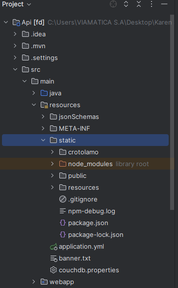

# Frontend
## Instrucciones

- En el API principal dirigirse al directorio "resource/static", como se presenta en la siguiente imagen:

    

- Dar clic derecho al directorio "static", seleccione
la siguiente opcion "Copy Path/Reference" 
   

- Se mostrará la siguiente ventana, seleccione la opcion "Absolute path"
   

- Abrir el simbolo de sistema (cmd), adjuntar el path que ha copiado en el paso anterior
 y escribir el comando "code . "

    

- En el Visual Studio Code, abrir la terminal, escriba el comando "npm i" para relizar las instalaciones de  librerias necesarias.

   

- Una vez hecho el paso anterior, navegar al directorio "cd crotolamo" y por último escribir el comando "npm run start".
 
    

- En caso de realizar modificaciones en el código, verificar en la terminal si los cambios se han aplicado correctamente.

    

