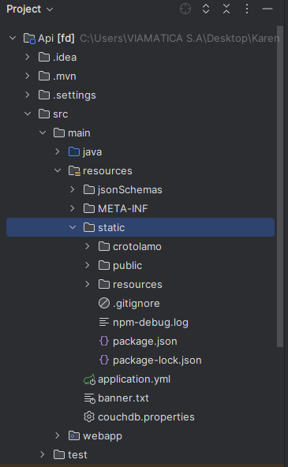
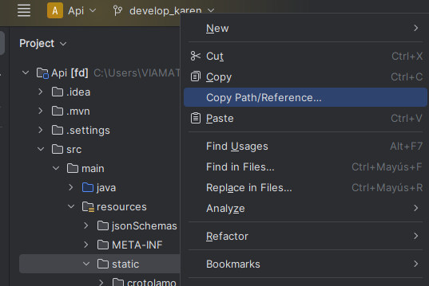
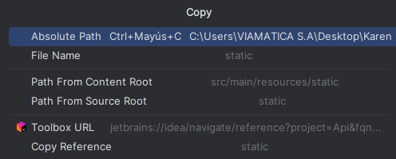
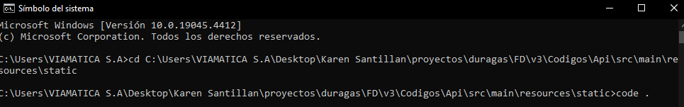
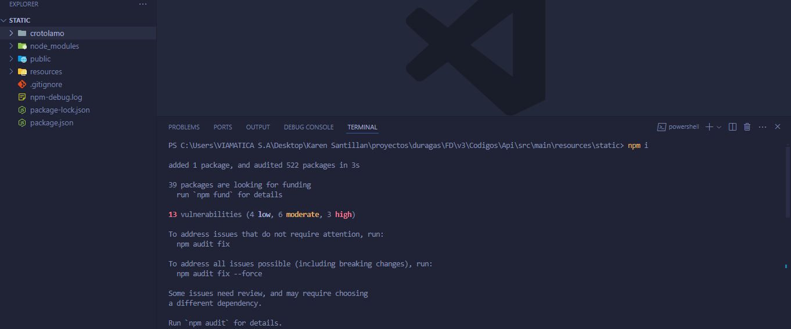
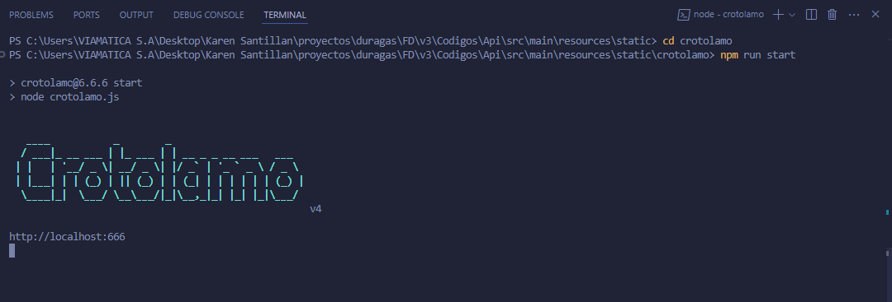
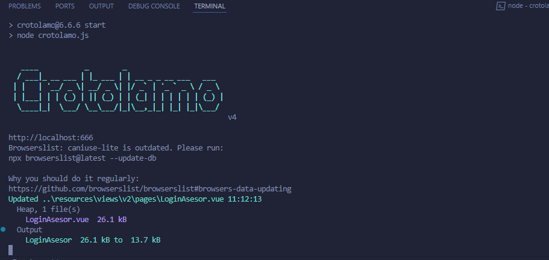

# Frontend

El siguiente proceso se detalla en cómo levantar el proyecto en Visual Studio Code, lo cual facilita visualizar las modificaciones a nivel de código de Vue.js y observar dicho cambios en la terminal, para mas detalle proceda a seguir con los siguientes pasos.

## Pasos a seguir para levantar el proyecto

- En la API principal dirigirse al directorio "resource/static", como se presenta en la siguiente imagen:

  

- Dar clic derecho al directorio "static", seleccione la siguiente opcion "Copy Path/Reference"
  

- Se mostrará la siguiente ventana, seleccione la opcion "Absolute path"
  

- Para acceder a la API en Visual Studio Code, abrir la terminal del simbolo de sistema (cmd), adjuntar el path que ha copiado en el paso anterior y escribir el comando " code . "

  

- Una vez hecho el paso anterior, abrir la terminal de visual studio y escriba el comando "npm i" para realizar las instalaciones de librerias necesarias.

  

- Dirigirse al directorio "cd crotolamo" y por ultimo para levantar la aplicación, escribir el siguiente comando "npm run start".

  

- En caso de realizar modificaciones en el código, verificar en la terminal si los cambios se han aplicado correctamente

  

  ### [Volver al README](https://github.com/JoelBaj/API/blob/main/Readme.md)
